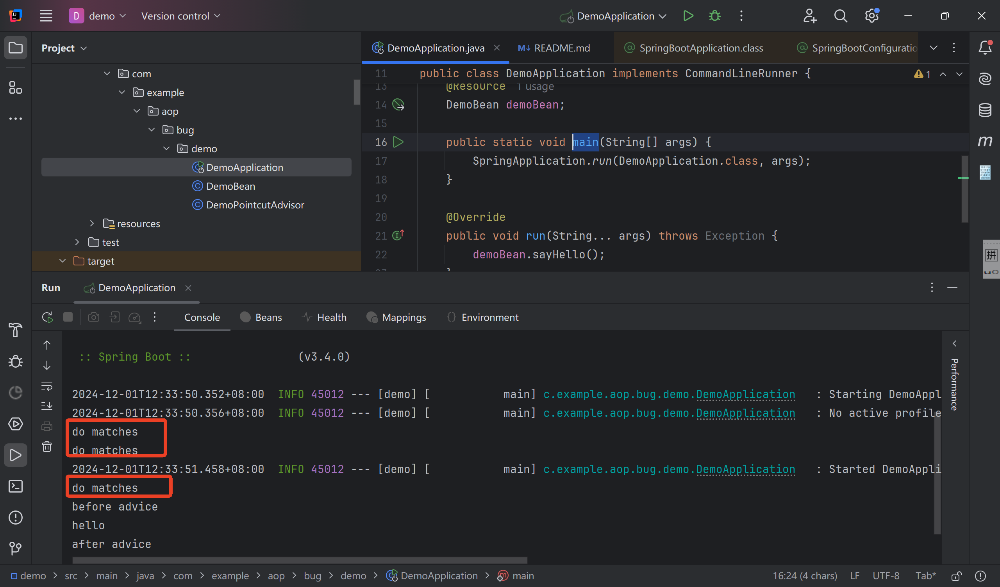
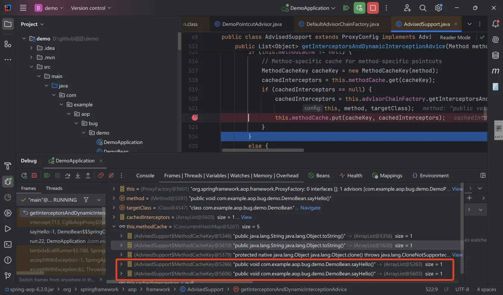

# Getting Started
This project demonstrates the issue of `methodCache` cache invalidation 
leading to repeated invocation of `MethodMatch`, as proposed in issue https://github.com/spring-projects/spring-framework/issues/33915.

After running `com.example.aop.bug.demo.DemoApplication.main`, 
it is observed that the `do matches` in `DemoPointcutAdvisor` is printed 
multiple times, as shown in the figure below. The first two prints occur 
during Bean initialization and proxy creation, respectively. The third print 
is when the `sayHello` method is invoked.

The reason for the third print is that the `methodCache` created during the second
method matching is ineffective. During the third 
method matching, the result of the second matching is not used, 
and instead, the same method is placed into the `methodCache` again, 
as shown in the figure below.

As mentioned in the issue, 
this is due to the `equals` method of `MethodCacheKey`.